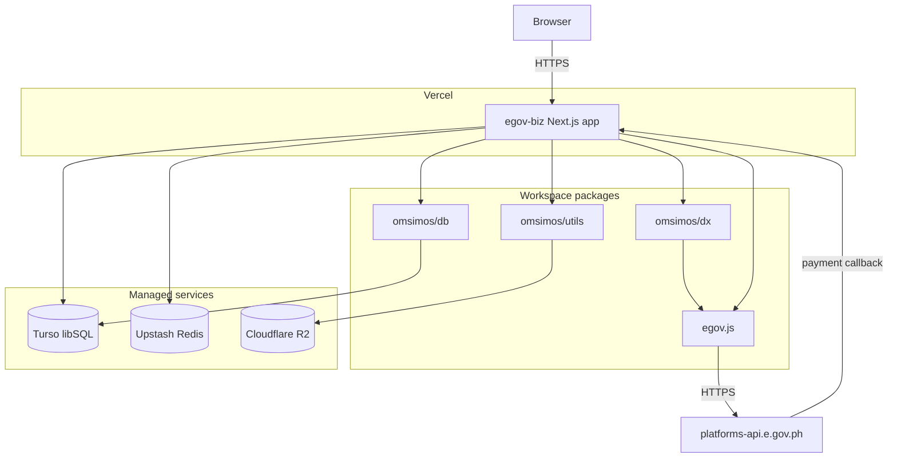

Everything the citizen touches is one Next.js 16 application, `apps/egov-biz`, running on
React 19 with the AI SDK 7 agent loop. The registration logic is not in the app: it lives in
workspace packages that the app composes. That split is what keeps the state machines
testable without a browser, a server, or a live gateway.

## Deployment view



Note the one inbound arrow that is not from a browser: eGovPay posts a payment callback back
into the app. That makes the callback route the only path where an external system initiates
a state change, which is why it verifies the transaction rather than trusting the payload.
[Payments](/egov/egovpay#the-callback-is-not-the-source-of-truth) covers that in detail.

## Workspace responsibilities

| Workspace        | Owns                                                              | Deliberately does not                     |
| ---------------- | ----------------------------------------------------------------- | ----------------------------------------- |
| `apps/egov-biz`  | Routes, agent loop, chat persistence, orchestration across tracks | Contain registration state machines       |
| `packages/dx`    | BNRS, LGU, and BIR flows and their state machines                 | Own routes, agent tools, or orchestration |
| `packages/db`    | Turso/libSQL persistence for DX, through Drizzle                  | Read the app's database                   |
| `packages/utils` | BIR PDF generation, private artifact store                        | Own the PDF template assets               |
| `egov.js`        | Typed client for the nine partner services                        | Hold any business logic                   |

`packages/dx` states the boundary explicitly: agent tools, routes, and orchestration are
outside the package. The app is the only place where the three tracks are aware of one
another.

## The gateway is one host

All nine partner services are reached through a single gateway host,
`https://platforms-api.e.gov.ph`, with a path per service. There is no per-service hostname
to configure and no service mesh in front of them. Each service still has its own
credentials and its own authentication handshake, so the app builds a separate `egov.js`
client per service, pointed at that service's configured base URL:

```ts
const client = createClient({ baseUrl: requireEnvironment("EGOVSSO_BASE_URL") });
```

Base URLs stay environment-configurable rather than hardcoded, because the documented
gateway URLs are staging or hackathon hosts and are expected to move.

## Build and local development

Bun workspaces with Turborepo. `oxlint` and `oxfmt` run as Turborepo root tasks over the
whole repository in one process rather than once per package.

```bash
bun install
cp .env.example .env
bun --filter egov-biz infra:up   # Redis on 127.0.0.1:6380
bun run dev:business             # http://localhost:3000
```

The app database needs no setup: `TURSO_DATABASE_URL` defaults to a local SQLite file and
the first query applies pending migrations. The DX database is separate and is **not**
migrated on demand — initialize it once with
`bun --env-file=.env --filter @omsimos/db db:migrate`. Why they are separate is covered in
[state and storage](/architecture/data-and-storage).
