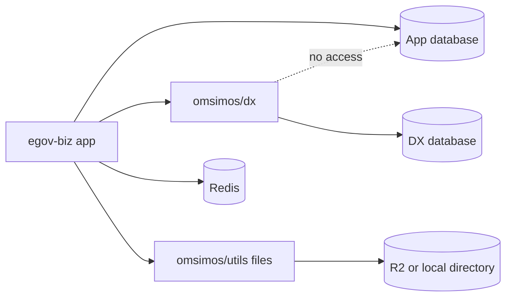

There are four places state lives, and the split between the first two is a deliberate
isolation boundary rather than an accident of growth.



## Two databases, on purpose

`@omsimos/db` ignores `TURSO_DATABASE_URL` entirely and reads only `DX_TURSO_*`. The DX
package therefore **cannot** reach the app database by accident, whatever the process working
directory happens to be.

| Database | Configured by                                  | Holds                                                                         | Migrations             |
| -------- | ---------------------------------------------- | ----------------------------------------------------------------------------- | ---------------------- |
| App      | `TURSO_DATABASE_URL`, `TURSO_AUTH_TOKEN`       | Conversations, chat messages, business records, auth sessions, SMS dispatches | Applied on first query |
| DX       | `DX_TURSO_DATABASE_URL`, `DX_TURSO_AUTH_TOKEN` | BNRS, LGU, and BIR registration state                                         | Applied by hand, once  |

The asymmetry in migrations is intentional and it is the most common local-setup trip-up:
the app database is created on demand, the DX database is not. Run
`bun --env-file=.env --filter @omsimos/db db:migrate` before using any registration flow.

## DX tables

BNRS uses four tables, splitting PII into its own one-to-one records rather than widening the
application row:

- `bnrs_applications` — ownership, lifecycle, business name, scope, fee snapshot, registration result, certificate number and validity
- `bnrs_owner_information` — the one-to-one owner PII record
- `bnrs_business_addresses` — the one-to-one required business-address PII record and its source
- `bnrs_payments` — every hosted-payment attempt and provider reference

LGU mirrors the shape with three of its own, sharing nothing with BNRS:

- `lgu_applications` — lifecycle, accepted credential, structured-address snapshot, derived city identity, permit and clearance issuance columns
- `lgu_applicant_information` — the separate owner name and optional TIN
- `lgu_payments` — every LGU hosted-payment attempt and provider reference

BIR stores no structured form data at all. It renders the PDF and keeps only the artifact.

## Fee and catalog snapshots

Fee and descriptor values are snapshotted onto each application at the time it is created, so
a later catalog change cannot retroactively alter an in-progress or completed record. A
certificate issued last month still reports the fee that was actually charged.

The same principle covers issued documents. The JSON certificate's fields are projected from
the authoritative normalized application, owner, and business-address records; the database
stores only the certificate number and validity timestamp rather than a frozen document blob.

## The artifact store

Generated BIR PDFs are private. `@omsimos/utils/files` writes to Cloudflare R2 when `R2_*` is
configured and to `FILE_STORAGE_DIRECTORY` (default `data/artifacts`) otherwise.

The storage key is derived from the trusted actor, not passed in:

```text
bir/<SHA-256 owner hash>/<artifact UUID>.pdf
```

Retrieval recomputes that key from the authenticated actor, so a different actor asking for
the same artifact UUID receives `FORM_NOT_FOUND` rather than someone else's tax form. The
owner hash means the storage layout itself does not leak eGov user IDs.

## Redis

Redis holds no durable domain state. It exists so an in-flight model stream survives a
browser reconnect, as described in
[chat request lifecycle](/architecture/request-lifecycle#resumable-streams). Losing Redis
loses stream continuity, not registrations.
