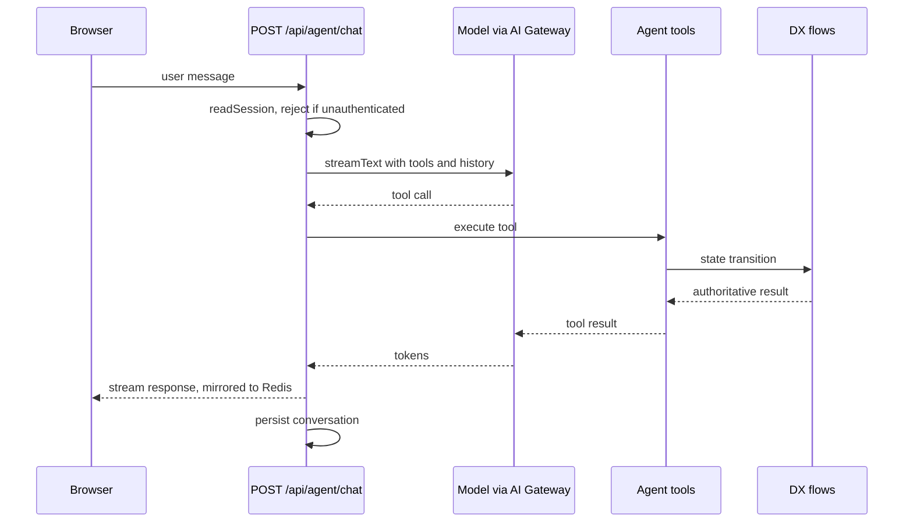
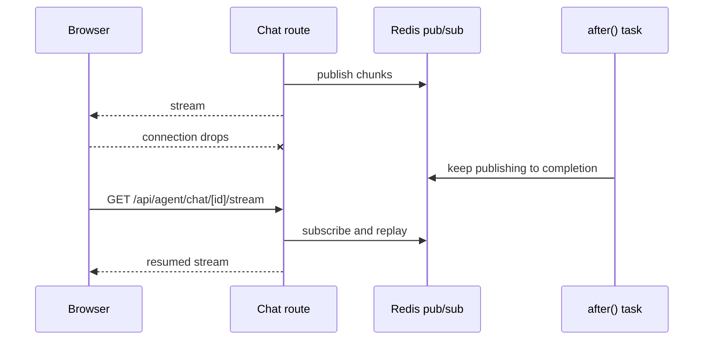

Registration happens inside a conversation, so the chat endpoint is the system's main
control path. A single message can trigger a web search, a DX state transition, a PDF
render, and an SMS — all while tokens stream back to the browser.

## One message, end to end



The model runs through the Vercel AI Gateway rather than eGov AI, because the partner
service's assistant endpoint generates text and has no tool-calling surface — the reasoning is
in [integration points](/egov/integration-points#why-the-agent-does-not-run-on-egov-ai).

The route reads the session first and rejects anything unauthenticated before the model is
ever called. The trusted eGov user ID comes from that session, never from the request body —
see [trust boundaries](/architecture/trust-boundaries#the-actor-is-never-client-supplied).

## The agent's tools

The agent loop is bounded by `stepCountIs`, and every capability it has is an explicit tool.
There is no free-form shell, database, or HTTP access.

| Tool                            | Purpose                                                 |
| ------------------------------- | ------------------------------------------------------- |
| `askUser`                       | Ask one intake question and wait                        |
| `updatePlan`                    | Advance the visible registration plan                   |
| `user_info`                     | Read available fields from the authenticated profile    |
| `webSearch`                     | Exa search through the AI Gateway, for official sources |
| `generate_bir_form`             | Render and store a BIR 1901 or 1905 PDF                 |
| `send_sms_message`              | Send an SMS through eMessage                            |
| `simulate_tax_payment_reminder` | Send a simulated BIR deadline reminder                  |

Registration state changes are not tools the model can call freely. Payment creation and
status sync run through route handlers, so the model can report a payment but cannot
fabricate one.

## Resumable streams

A model keeps producing tokens after the response headers are flushed. If the citizen's
browser reconnects — a tab switch on mobile, a flaky connection mid-registration — a plain
stream is lost and the turn is gone. The app writes every chunk to Redis through
`resumable-stream`, and `GET /api/agent/chat/[id]/stream` replays it.



Two details here are easy to get wrong, and both are commented in the source.

**`waitUntil` must be `after`.** On a serverless platform the invocation can be frozen once
headers are flushed. `next/server`'s `after` is what keeps the function alive until the
stream finishes writing to Redis. Passing `null` — which is correct for a long-lived
container — truncates streams on Vercel.

**Redis must be a TCP URL.** `resumable-stream` needs a pub/sub subscription, and Upstash's
`KV_REST_API_URL` REST client cannot hold one. `apps/egov-biz/src/lib/env.ts` rejects
anything that is not `redis:` or `rediss:` up front, with an error naming the fix, rather
than failing later at connect time:

```ts
if (protocol !== "redis:" && protocol !== "rediss:") {
  throw new Error(
    `REDIS_URL must use redis:// or rediss://, not ${protocol} — the Upstash REST endpoint does not support pub/sub`,
  );
}
```

The publisher and subscriber are separate connections cached on `globalThis`, so hot reloads
in development do not leak sockets.

## Degraded modes

The app is built to keep working when optional credentials are absent, which matters for a
demo environment.

| Missing              | Effect                                                                            |
| -------------------- | --------------------------------------------------------------------------------- |
| `AI_GATEWAY_API_KEY` | Deterministic local intake questions, no web search. Registration still completes |
| `EGOVPAY_*`          | Registration stops at the first fee                                               |
| `EMESSAGE_*`         | No SMS delivery                                                                   |
| `R2_*`               | Generated PDFs fall back to `FILE_STORAGE_DIRECTORY`                              |
| `REDIS_URL`          | Required. Streams cannot resume after a reconnect                                 |

Only eGov SSO and Redis are hard requirements. On loopback there is a dev session at
`/api/auth/dev-login` that skips sign-in, which is also what the E2E suite uses.
