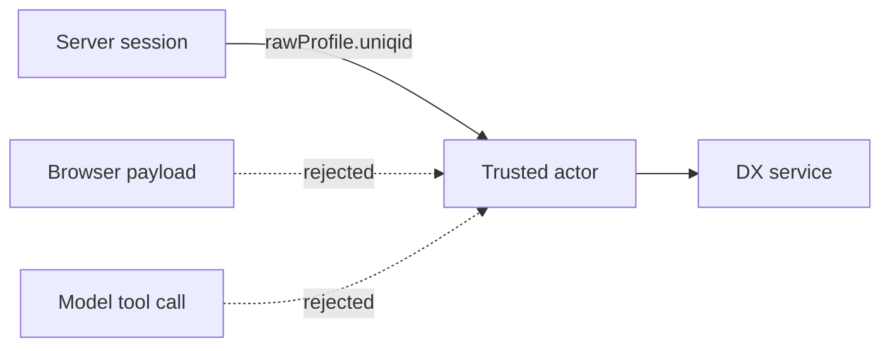

Three rules govern every integration in this system. Each one exists because the obvious
alternative is exploitable.

## Credentials stay server-side

Partner credentials never reach the browser. There are exactly two exceptions, both
structurally necessary to start a redirect-based sign-in:

| Value                    | Rendered to browser | Why                                     |
| ------------------------ | ------------------- | --------------------------------------- |
| `EGOVSSO_BASE_URL`       | Yes                 | The browser has to be sent there        |
| `EGOVSSO_PARTNER_CODE`   | Yes                 | Identifies the partner in the login URL |
| `EGOVSSO_PARTNER_SECRET` | **No**              | Server-side token exchange only         |

Everything else — the eGovPay API key, the eMessage access token, database tokens, the AI
Gateway key — is read from `process.env` inside route handlers and server modules only.

Turborepo hides any variable a task does not declare, so a value set on the Vercel project
never reaches the build unless it is listed in `turbo.json`'s `globalEnv`. The wildcards
there (`EGOVSSO_*`, `EGOVPAY_*`, and so on) cover the per-service credential groups.

## The actor is never client-supplied

The trusted eGov user ID comes from the authenticated SSO profile's `rawProfile.uniqid`, and
nothing else:

```ts
const actor = { egovUserId: session.rawProfile.uniqid };
```

`packages/dx` states the rule directly: _do not accept `egovUserId` from an agent or browser
payload._ This matters more than usual here because there is a language model in the request
path. A model that could pass an arbitrary actor ID into a DX call would be able to read
another citizen's application by being asked nicely.

DX itself stays stateless. It receives the trusted actor, then loads and authorizes the
application through its own repository.



## External payloads are verified, not believed

The eGovPay callback is the only inbound path where an external system initiates a state
change. DX does not let the callback body decide the outcome: it looks the transaction up
through eGovPay and verifies its UUID, transaction ID, amount, and currency before changing
any application state.

The callback route also tolerates a real-world inconsistency. eGovPay has posted the
transaction reference under three different spellings across environments, so all three are
read and the first usable one wins, each field catching its own failure so a bad value under
one key cannot hide a good reference under another:

```ts
const callbackSchema = z
  .object({
    uuid: z.string().min(1).optional().catch(undefined),
    transaction_uuid: z.string().min(1).optional().catch(undefined),
    transactionUuid: z.string().min(1).optional().catch(undefined),
  })
  .catch({});
```

## PII exposure is narrowed at the response boundary

DX status responses are written to expose as little as possible:

- Owner information reports only _whether_ it is stored, never the owner fields.
- Business addresses expose only `{ stored, source }`, never the address itself.
- Payment sync returns the transaction reference, certificate number, and issue time — not the owner or address, because a transaction UUID is not actor authorization.

That last point is the sharpest one. The callback knows a transaction UUID but has no
authenticated citizen behind it, so it deliberately cannot retrieve the citizen's data. Full
certificates are fetched afterward through actor-scoped `getCertificate`.

## What is explicitly not verified

Being honest about the demo's limits is part of the documentation. The LGU credential
contract validates the _shape_ of a BNRS certificate — required fields, complete structured
address, supported issuer and status, date consistency, expiry, normalized owner-name match —
but it is not proof of authenticity. LGU has no BNRS lookup and no signature check. TIN
values are not verified, and the demo RDO assignment is random rather than an address-based
jurisdiction lookup.

Running any of this against real citizen data requires the corresponding partner credentials
and approval.
