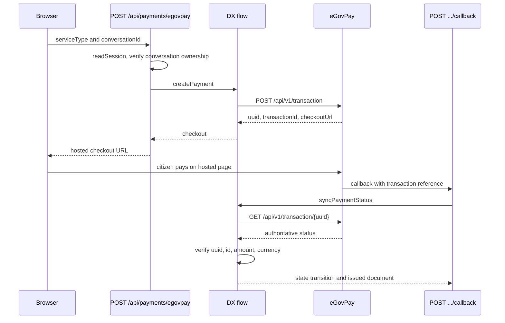

Every fee in the system is collected through eGovPay hosted checkout. The app never handles
card or wallet details; it creates a transaction, sends the citizen to a hosted page, and
learns the outcome by verifying the transaction afterward.

Three separate fees run through this path, each owned by a different track:

| Fee                                          | Amount                           | Owner                       |
| -------------------------------------------- | -------------------------------- | --------------------------- |
| DTI business name registration + DST         | PHP 530 / 1,030 / 2,030 by scope | `@omsimos/dx/bnrs`          |
| LGU business permit incl. barangay clearance | PHP 2,500 fixed                  | `@omsimos/dx/lgu`           |
| BIR documentary stamp tax                    | PHP 30                           | `server/bir-dst-payment.ts` |

## Checkout and confirmation



The LGU track uses an independently configured eGovPay account. `LGU_EGOVPAY_*` falls back to
the shared `EGOVPAY_*` values when unset, but the credentials, settlement template, provider
instance, and environment configuration belong to LGU — the package is explicit that they are
not shared with BNRS.

## Request signing

Each transaction carries an HMAC-SHA256 digest over the amount and transaction ID. Test keys
are prefixed `test_`, and that prefix is stripped before it is used as the signing key:

```ts
export function createEgovPayDigest(amount: number, transactionId: string, apiKey: string) {
  const signingKey = apiKey.startsWith("test_") ? apiKey.slice(5) : apiKey;
  return createHmac("sha256", signingKey).update(`${amount}|${transactionId}`).digest("hex");
}
```

## The callback is not the source of truth

This is the most important property of the payment integration. The callback body does **not**
decide the result. DX looks the transaction up through eGovPay and verifies its UUID,
transaction ID, amount, and currency before changing any application state. A forged or
replayed callback cannot mint a certificate.

The callback also has to survive a real inconsistency in the platform: eGovPay has posted the
transaction reference under three different spellings across its environments. All three keys
are read, the first usable one wins, and each field catches its own parse failure so an
unexpected value under one key cannot mask a good reference under another.

```ts
const transactionUuid = body.uuid ?? body.transaction_uuid ?? body.transactionUuid;
```

Because the callback carries no authenticated citizen, it deliberately cannot read citizen
data. Payment sync returns only the transaction reference, certificate number, and issue
time. A transaction UUID is not actor authorization.

The same `syncPaymentStatus({ transactionUuid })` entry point is used from both the callback
and the browser return path, so whichever arrives first settles the payment and the other is a
no-op.

## Idempotency and retries

Payments are the place where duplicate charges and duplicate documents both become real
risks, so several behaviours are specified rather than incidental:

- Repeated checkout creation reuses the current pending link instead of opening a second payment.
- If checkout creation is interrupted, retries keep the same provider transaction ID.
- An authoritative callback can attach the provider UUID to the creating attempt, and a later retry restores a missing checkout URL without opening a second logical payment attempt.
- Certificate issuance is part of the same idempotent database transition as payment completion, so payment retries and callback races preserve the first certificate identity.
- A failed, expired, or voided payment returns a BNRS application to `PAYMENT_READY` so the citizen can retry.

Every hosted-payment attempt is recorded — `bnrs_payments` and `lgu_payments` — rather than
overwriting a single payment row, so the attempt history survives.

## Error handling at the route

The payment route distinguishes failure classes so the citizen sees something actionable
rather than a generic error:

| Condition                                     | Status | Meaning                                 |
| --------------------------------------------- | ------ | --------------------------------------- |
| No session                                    | 401    | Not signed in                           |
| Unknown conversation                          | 404    | Chat session not found                  |
| `BnrsError`, `LguError`, `BirDstPaymentError` | 409    | Flow state rejects payment now          |
| Missing BIR 1901 artifact                     | 409    | Generate the form before paying its DST |
| `PaymentUrlConfigurationError`                | 503    | Online payment is misconfigured         |
| Classified network error                      | 503    | Gateway unreachable                     |
| Anything else                                 | 502    | Checkout could not be opened            |

## Tunnelling for local development

eGovPay has to reach the callback URL, which localhost is not. `EGOVPAY_CALLBACK_URL` and
`EGOVPAY_RETURN_URL` are both derived from `APP_URL` when unset, so pointing `APP_URL` at a
tunnel host is usually the only change needed.
