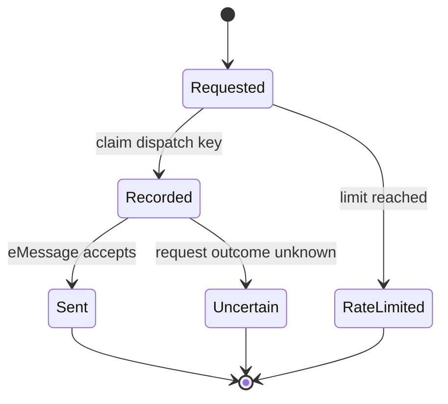

eMessage sends SMS through a single operation, `POST /messaging/v1/sms/push`, authenticated
with a static access token. It is the simplest partner integration in the system — and the
one that needed the most defensive machinery around it, because a language model decides when
to call it.

## Two agent tools

| Tool                            | Sends                                          |
| ------------------------------- | ---------------------------------------------- |
| `send_sms_message`              | A message the citizen explicitly asked to send |
| `simulate_tax_payment_reminder` | A simulated BIR deadline reminder              |

The reminder content comes from `createBirDemoTaxCalendar`, which returns four upcoming
simulated deadlines for a `Self-employed`, `Sole proprietor`, or `Company` record. Every entry
carries `simulated: true` and a confirmation note. It is explicitly not a tax-type
determination: business type alone does not establish VAT or percentage-tax status,
withholding obligations, elections, fiscal year, or official filing deadlines.

## Why there is a dispatch ledger

An SMS is irreversible and costs money. A retried tool call, a resumed stream, or a model that
loops could send the same message repeatedly. `server/sms-dispatches.ts` records each dispatch
against a composite key:

```ts
export type SmsDispatchKey = {
  actorId: string;
  conversationId: string;
  recipient: string;
  toolName: SmsDispatchTool;
  userMessageId: string;
};
```

Keying on `userMessageId` is what makes this work: retries of the _same_ citizen turn collapse
to one send, while a genuinely new request from the citizen is allowed through.



Two failure states are modelled explicitly rather than collapsed into a generic error:

- `SmsDispatchUncertainError` — a prior dispatch may already have been accepted, so it will **not** be retried automatically. Choosing a possible missed message over a possible duplicate is the deliberate trade.
- `SmsDispatchRateLimitError` — the sending limit is reached; try again later.

## Degradation

Without `EMESSAGE_BASE_URL` and `EMESSAGE_ACCESS_TOKEN` the tools fail with a named
missing-variable error and no SMS is delivered. Registration is unaffected — SMS is a
notification channel, never a step in a flow.
