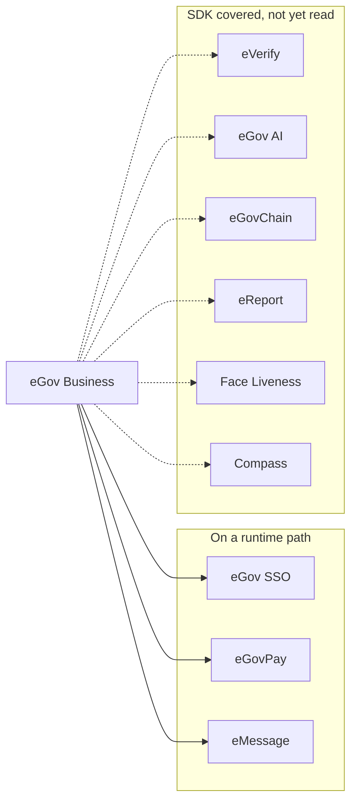

All nine partner services are reached through one gateway host,
`https://platforms-api.e.gov.ph`, with a path per service. Every call goes through
[`egov.js`](https://egov-sdk.omsimos.com), a typed SDK generated from an OpenAPI
specification with a Fetch client and no runtime dependencies. The SDK is versioned and
released separately from this repository.

## What is wired today



| Service                    | Status    | Used for                                             | Credentials                                           |
| -------------------------- | --------- | ---------------------------------------------------- | ----------------------------------------------------- |
| [eGov SSO](/egov/sso)      | Wired     | Citizen sign-in and profile                          | `EGOVSSO_PARTNER_CODE`, `EGOVSSO_PARTNER_SECRET`      |
| [eGovPay](/egov/egovpay)   | Wired     | Every registration fee                               | `EGOVPAY_API_KEY`, `EGOVPAY_SETTLEMENT_TEMPLATE_UUID` |
| [eMessage](/egov/emessage) | Wired     | SMS confirmations and reminders                      | `EMESSAGE_ACCESS_TOKEN`                               |
| eVerify                    | Available | Identity and QR verification                         | `EVERIFY_*`                                           |
| eGov AI                    | Available | Text generation, translation, document extraction    | `EGOVAI_*`                                            |
| eGovChain                  | Available | EVM-compatible JSON-RPC reads and signed submissions | `EGOVCHAIN_*`                                         |
| eReport                    | Available | Complaint submission, OTP, location datasets         | `EREPORT_*`                                           |
| Face Liveness              | Available | Liveness sessions and results                        | `EGOVLIVENESS_*`                                      |
| Compass                    | Available | Budget releases, allocations, obligations            | `EGOVCOMPASS_*`                                       |

`.env.example` carries gateway URLs for all nine. The six marked available are covered by the
SDK and have credential slots, but no workspace reads them yet — they are not dead
configuration, they are the next integrations.

## Operations actually called

Three services, six operations. That is the entire external write surface of this system.

| Service  | Operation             | Path                                   | Called from              |
| -------- | --------------------- | -------------------------------------- | ------------------------ |
| eGov SSO | `generateAccessToken` | `POST /api/token`                      | `lib/auth/exchange.ts`   |
| eGov SSO | `authenticate`        | `POST /api/partner/sso_authentication` | `lib/auth/exchange.ts`   |
| eGovPay  | `generatePayment`     | `POST /api/v1/transaction`             | DX payment providers     |
| eGovPay  | `getTransaction`      | `GET /api/v1/transaction/{uuid}`       | Callback and status sync |
| eGovPay  | `voidTransaction`     | `PUT /api/v1/transaction/{uuid}/void`  | Available through DX     |
| eMessage | `sendSms`             | `POST /messaging/v1/sms/push`          | `lib/emessage.ts`        |

## How clients are constructed

Each service gets its own client, pointed at its own configured base URL. There is no shared
singleton, because each service has distinct credentials and its own authentication
handshake.

```ts
const client = createClient({ baseUrl: requireEnvironment("EGOVSSO_BASE_URL") });
```

Base URLs are always read from the environment rather than hardcoded. The documented gateway
URLs are staging or hackathon hosts and are expected to move.

Two authentication shapes appear across the platform, and both are visible in the calls above:

- **Exchange then bearer.** eGov SSO and eGov AI mint a short-lived access token from a partner credential, then pass it as a bearer token. eGov SSO does this twice per sign-in: token, then profile.
- **Static key.** eGovPay and eMessage authenticate each call directly. eGovPay additionally requires an HMAC digest over the amount and transaction ID, described in [payments](/egov/egovpay#request-signing).

## Timeouts

Partner calls carry explicit abort signals rather than relying on a platform default. Sign-in
uses a 12-second budget per leg:

```ts
signal: AbortSignal.timeout(12_000),
throwOnError: true,
```

`throwOnError` is set so a non-2xx response raises instead of returning a result object that
a caller might read past.
