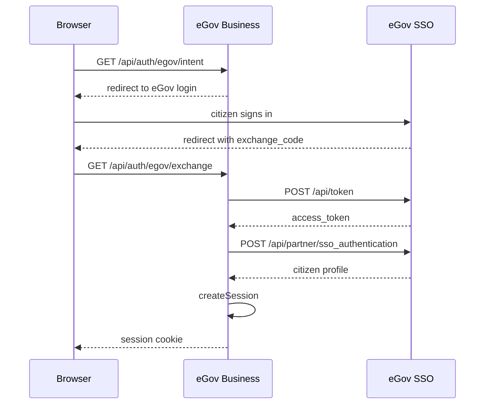

Sign-in is the only way a citizen gets an identity in this system, and that identity is the
root of every authorization decision downstream. There is no local account, no password, and
no user table keyed by anything other than the eGov user ID.

## The exchange



Two legs, both server-side. The first trades the `exchange_code` plus the partner credential
pair for an access token, scoped to `SSO_AUTHENTICATION`. The second uses that token as a
bearer credential to fetch the citizen profile.

```ts
export async function exchangeEgovSsoCode(exchangeCode: string) {
  const client = createClient({ baseUrl: requireEnvironment("EGOVSSO_BASE_URL") });
  const token = await egovSso.generateAccessToken({
    body: {
      exchange_code: exchangeCode,
      partner_code: requireEnvironment("EGOVSSO_PARTNER_CODE"),
      partner_secret: requireEnvironment("EGOVSSO_PARTNER_SECRET"),
      scope: "SSO_AUTHENTICATION",
    },
    client,
    signal: AbortSignal.timeout(12_000),
    throwOnError: true,
  });
  const authentication = await egovSso.authenticate({
    auth: token.access_token,
    client,
    signal: AbortSignal.timeout(12_000),
    throwOnError: true,
  });
  return await createSession(authentication.data);
}
```

The partner secret never leaves the server. The browser only ever sees `EGOVSSO_BASE_URL` and
`EGOVSSO_PARTNER_CODE`, which are needed to build the login redirect.

## What the profile provides

The profile is not just an identity — it is the prefill source that makes a chat-driven
registration tolerable, because the citizen does not retype what the government already
knows.

| From the profile                                                | Used for                                                   |
| --------------------------------------------------------------- | ---------------------------------------------------------- |
| `rawProfile.uniqid`                                             | The trusted actor ID for every DX call                     |
| Citizenship, first/middle/last name, suffix, birth date, gender | BNRS owner information                                     |
| Full name, optional TIN                                         | LGU applicant information                                  |
| Residential address                                             | Offered as the business address, source `EGOV_RESIDENTIAL` |
| Email, mobile                                                   | eGovPay checkout contact, SMS recipient                    |

The BNRS mapper is deliberately conservative in both directions. It maps only those six owner
fields and silently omits anything missing; civil status, email, and mobile are not mapped or
stored by BNRS at all. The residential-address mapper returns `null` unless address line 1,
barangay, city/municipality, province, region, and a four-digit postal code are _all_
present — a partial address is treated as no address rather than a half-filled form.

Deciding whether to reuse the residential address or collect a different one stays outside
DX. The agent or route makes that call and submits the result with an explicit source.

## The actor ID is load-bearing

```ts
const actor = { egovUserId: session.rawProfile.uniqid };
```

Every DX operation is scoped to this value, and it comes only from the server-side session.
See [trust boundaries](/architecture/trust-boundaries#the-actor-is-never-client-supplied) for
why that is enforced rather than assumed.

## Loopback dev session

Signing in needs a real eGovPH account, which makes local development and automated E2E runs
awkward. On loopback only, `/api/auth/dev-login` mints a session without the exchange. The
Stagehand E2E suite uses the same route.
