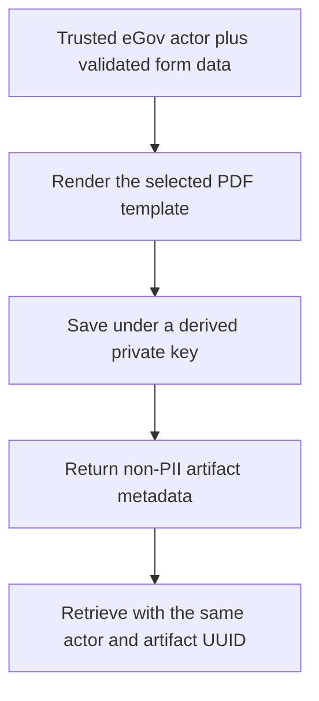

`@omsimos/dx/bir` fills BIR Form 1901 or 1905, saves the generated PDF through the shared
private file-storage module, and reads it back for the authenticated owner. Unlike BNRS and
LGU there is no application state machine here — the unit of work is an artifact.

## Pipeline



Form input is validated before rendering, and a render failure is never saved. There is no
partially-written artifact to clean up.

The structured form data is deliberately **not** stored separately. The rendered PDF is the
record.

## Private storage keys

```text
bir/<SHA-256 owner hash>/<artifact UUID>.pdf
```

Storage is Cloudflare R2 when `R2_*` is configured and a local directory otherwise. The key is
derived from the trusted actor rather than supplied by the caller, so retrieval by a different
actor returns `FORM_NOT_FOUND` for the same artifact UUID. Hashing the owner ID keeps the
storage layout itself from leaking eGov user IDs.

Template paths are required configuration, because `@omsimos/utils` does not own the PDF
assets:

```ts
const bir = createBirFormService({
  storage: createFileStorage(),
  templatePaths: {
    "1901": resolve(process.cwd(), "public/forms/bir-form-1901.pdf"),
    "1905": resolve(process.cwd(), "public/forms/bir-form-1905.pdf"),
  },
});
```

## Documentary stamp tax

The PHP 30 documentary stamp tax is paid through eGovPay like any other fee, but it is gated
on the artifact existing first. `POST /api/payments/egovpay` with
`serviceType: "bir-documentary-stamp-tax"` looks for a `1901` artifact in the conversation and
returns 409 — _"Generate BIR Form 1901 before paying the documentary stamp tax"_ — if there
is none.

Unlike BNRS and LGU, this payment is orchestrated by the app in
`server/bir-dst-payment.ts` rather than by a DX state machine, because there is no application
lifecycle to advance.

## RDO assignment is simulated

`assignDemoRdo` randomly chooses a code-only assignment such as `RDO 047`. The caller retains
it and may put that code into the form data.

This is **not** an address-based jurisdiction lookup and must not be used for a real filing.
The demo also does not collect the Tax Type Questionnaire, which remains required for actual
NewBizReg filing.

## Simulated tax calendar

`createBirDemoTaxCalendar` returns four upcoming simulated reminders for a `Self-employed`,
`Sole proprietor`, or `Company` record, sorted by due date. Reminder titles and the individual
or corporate income-tax form families vary by legal business type. Pass `asOf` to make tests
and snapshots deterministic:

```ts
const calendar = createBirDemoTaxCalendar({
  businessType: "Self-employed",
  asOf: new Date("2026-07-30T00:00:00.000Z"),
});
```

Every entry carries `simulated: true` and a confirmation note. The calendar is explicitly not
a tax-type determination: business type alone does not establish VAT or percentage-tax status,
withholding obligations, elections, fiscal year, or official filing deadlines.

The generator is pure. It does not read, update, or store business records — callers decide
whether to persist the result. It feeds the `simulate_tax_payment_reminder` agent tool
described in [eMessage](/egov/emessage).
