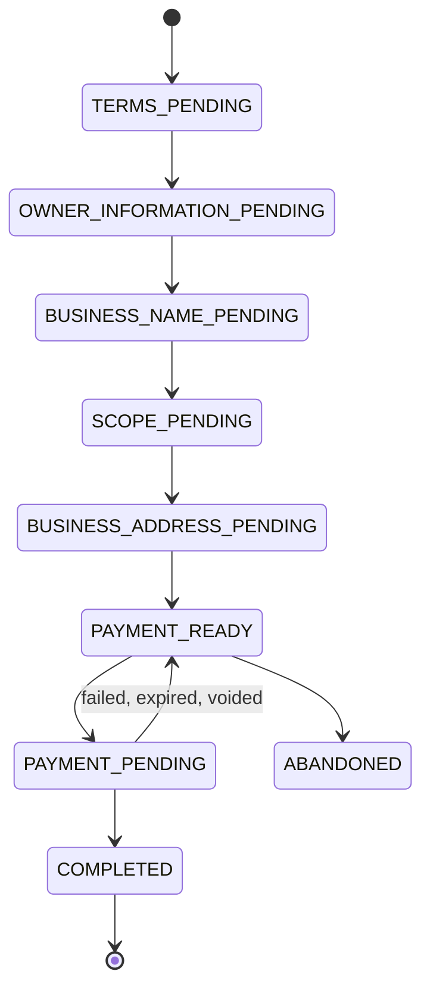
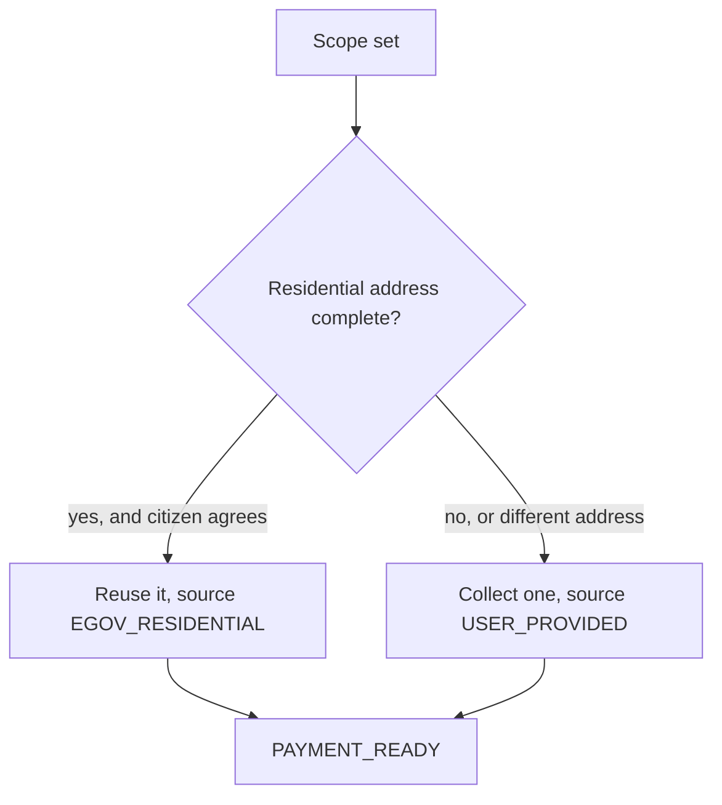

`@omsimos/dx/bnrs` models sole-proprietorship business-name registration. The operations are
local and database-backed; hosted payment is delegated to eGovPay. There are no live DTI/BNRS
API calls — this is a local model of the flow, not a proxy to it.

## State machine

Name, scope, and business address can be edited while the application sits at
`PAYMENT_READY`, and are locked once payment begins. Payment cannot start while the required
business address is missing.

Only one active application is allowed per eGov user. Completed and abandoned applications
remain in history. A business name counts as reserved only when a database record holds it in
`PAYMENT_PENDING` or `COMPLETED` — there are no built-in reserved-name fixtures.

## Steps and the data each needs

| State                       | Needs                                               | Source                         |
| --------------------------- | --------------------------------------------------- | ------------------------------ |
| `TERMS_PENDING`             | Terms acceptance                                    | Citizen                        |
| `OWNER_INFORMATION_PENDING` | Citizenship, name parts, suffix, birth date, gender | SSO profile mapper             |
| `BUSINESS_NAME_PENDING`     | Dominant name plus a descriptor ID                  | Citizen, agent suggests        |
| `SCOPE_PENDING`             | `CITY_MUNICIPALITY`, `REGIONAL`, or `NATIONAL`      | Citizen                        |
| `BUSINESS_ADDRESS_PENDING`  | Complete structured address                         | Residential reuse or collected |
| `PAYMENT_READY`             | —                                                   | eGovPay checkout               |

The descriptor catalog holds 40 stable IDs selected from the official BNRS descriptor list.
It intentionally exposes descriptors only, not the full
section/division/group/class/subclass classification.

## The business address decision

The business address is a separate required step after territorial scope, and the choice
between two sources is made outside DX:

`mapEgovSsoProfileToBnrsResidentialAddress` returns `null` unless address line 1, barangay,
city/municipality, province, region, and a four-digit postal code are all available.
`setBusinessAddress` applies the same completeness checks to either source, so a
`USER_PROVIDED` address is held to the same standard as a government-supplied one.

DX validates and stores the address it receives. Deciding _which_ address to use stays with
the agent or route.

## Fees

| Scope             | Registration | DST    | Total     |
| ----------------- | ------------ | ------ | --------- |
| City/Municipality | PHP 500      | PHP 30 | PHP 530   |
| Regional          | PHP 1,000    | PHP 30 | PHP 1,030 |
| National          | PHP 2,000    | PHP 30 | PHP 2,030 |

Fee and descriptor values are snapshotted on each application, so a later catalog change
cannot alter an in-progress or completed record.

## What payment produces

After verified payment, and inside the _same_ idempotent database transition, BNRS generates
two distinct identifiers:

- A transaction reference, `BNRS-YYYYMMDD-XXXXXXXX`
- A mock DTI Certificate No. / Business Name Number, `BNN-YYYYMMDD-XXXXXXXX`

Because issuance shares the transition with payment completion, retries and callback races
preserve the first certificate identity.

Payment sync returns only the transaction reference, certificate number, and issue time. It
never exposes the owner or business address, because a transaction UUID is not actor
authorization. The full JSON certificate is fetched afterward with actor-scoped
`getCertificate`, and contains the certificate number, `DTI-BNRS` issuing agency, business and
owner names, descriptor, territorial scope, structured address, issue time, five-year
validity, and `REGISTERED` status. The address _source_ is not included.

`listRegisteredBusinesses({ actor })` returns the citizen's completed registrations, newest
first, carrying the certificate number rather than duplicating the whole certificate.

## Deferred

- Civil status, email, and mobile are not mapped or stored
- Refugee/stateless and related owner questions are skipped
- Barangay scope is not included yet
- Live DTI/BNRS API calls, agent tools, and routes are outside the package
- Certificate PDF generation is deferred; the structured JSON certificate is implemented
