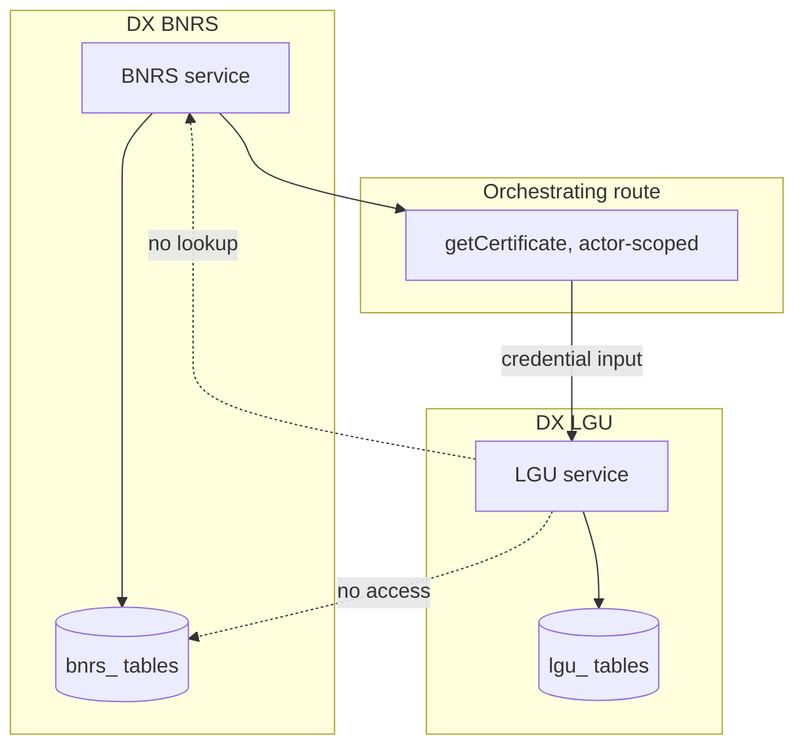
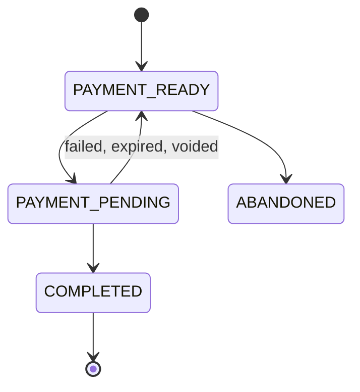

`@omsimos/dx/lgu` is a local model of a straightforward sole-proprietor LGU business-permit
flow. It accepts a business-name certificate credential, derives the issuing city from the
address inside it, charges one fixed fee, and issues both a business permit and a barangay
clearance immediately after authoritative payment confirmation.

## Agency isolation

This is the sharpest architectural boundary in the repository, so it is worth stating
plainly: **the LGU module does not import, call, query, or share persistence with the BNRS
module.** Neither has access to the other's service, repository, database tables, or domain
types.



The caller retrieves a completed certificate from the appropriate source and passes only
structurally compatible details across. Do not give LGU a BNRS repository or service
instance.

## The credential contract

```ts
type LguBusinessRegistrationCredentialInput = {
  certificateNumber: string;
  issuingAgency: "DTI-BNRS";
  businessName: string;
  ownerName: string;
  descriptor: string;
  territorialScope: "CITY_MUNICIPALITY" | "REGIONAL" | "NATIONAL";
  businessAddress: {
    addressLine1: string;
    addressLine2?: string;
    barangay: string;
    cityMunicipality: string;
    province: string;
    region: string;
    postalCode: string;
  };
  issuedAt: string;
  validUntil: string;
  status: "REGISTERED";
};
```

LGU validates required fields, the complete structured address, the supported issuer and
status, date consistency, expiry, and a normalized owner-name match.

This is an input contract, **not proof of authenticity.** LGU has no BNRS lookup and no
cryptographic verification. In a production system this boundary would need a signature or a
registry call; the demo's honesty about that gap is deliberate.

## Lifecycle



Shorter than BNRS, because the credential already carries the applicant and business data
that BNRS had to collect step by step.

## City identity and uniqueness

LGU does not accept a separate city. It stores the structured address carried by the
credential and derives its city identity from `cityMunicipality`. Address fields are
Unicode-normalized, trimmed, and whitespace-collapsed; the postal code must contain four
digits.

One non-abandoned application is allowed per combination of eGov user, certificate number,
and normalized city. The same certificate can therefore produce permits in different cities.
A matching retry resumes the immutable snapshot; different applicant or certificate details
conflict. An unpaid application may be abandoned and replaced.

## Fee

A fixed **PHP 2,500** for every city, exposed as one line item that includes the barangay
clearance. There is no city fee table, no effective dates, no fee versioning, and no
fee-change behaviour.

Payment runs through an independently configured eGovPay account. `LGU_EGOVPAY_*` falls back
to the shared `EGOVPAY_*` values when unset, but the credentials, settlement template,
provider instance, and configuration belong to LGU.

## Issued documents

Verified payment immediately approves the application and atomically issues exactly one
stable pair:

| Document           | Number                 | Type                          | Status     |
| ------------------ | ---------------------- | ----------------------------- | ---------- |
| Business permit    | `LGU-BP-YYYY-XXXXXXXX` | `NEW_BUSINESS`                | `ACTIVE`   |
| Barangay clearance | `LGU-BC-YYYY-XXXXXXXX` | `BARANGAY_BUSINESS_CLEARANCE` | `APPROVED` |

The permit carries the issuing city, BNRS certificate number, business and owner details,
optional full TIN, activity, certificate territorial scope, issue and validity dates, and the
PHP 2,500 total paid. The clearance carries the same business, owner, and activity data plus
`includedInBusinessPermitFee: true`.

Both include the structured business address and expire at `23:59:59.999Z` on December 31 of
their issue year. Payment callbacks and retries preserve the first numbers and timestamps.

No JSON document blob is stored, and there is no separate barangay-clearance table — the pair
is issued through dedicated columns on `lgu_applications`.

## Out of scope

- Certificate authenticity checks and direct BNRS access
- Territorial-scope-to-city compatibility rules, and authoritative city/barangay catalogs
- Multiple same-city branches
- Terms, undertakings, and additional form stages
- TIN verification
- Capitalization, employees, tenancy, cedula, and ancillary permits
- Review, inspections, and processing delays
- Renewals, amendments, cancellation, revocation, post-release workflows
- PDF generation, document storage, UI/routes, and agent integration
