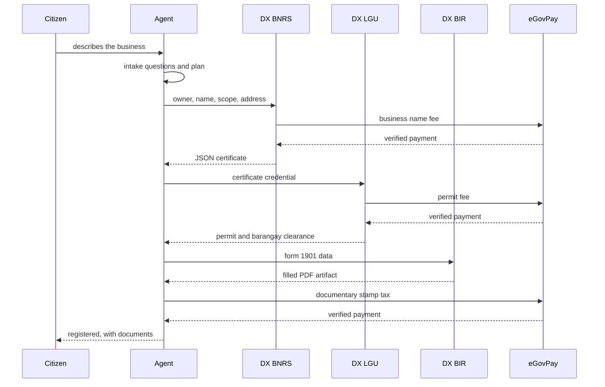
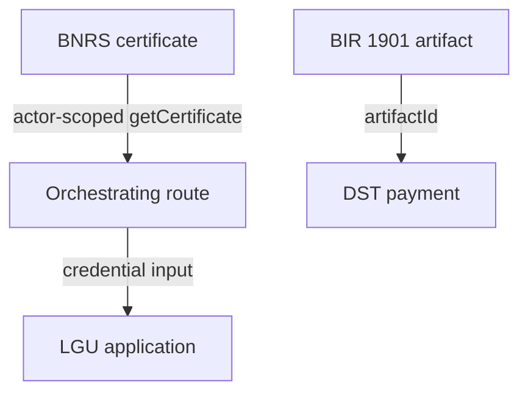

A full sole-proprietor registration crosses three agencies and three payments. The citizen
experiences one conversation; the system runs three independent state machines and joins them
at two handoff points.

## End to end

The ordering is not arbitrary. LGU requires a completed BNRS certificate as its input
credential, and the BIR documentary stamp tax cannot be paid until Form 1901 exists — the
payment route returns 409 with _"Generate BIR Form 1901 before paying the documentary stamp
tax"_ if asked out of order.

## Two handoffs

The app is the only component aware of more than one track, and it performs exactly two
handoffs:

Both handoffs go through the app deliberately. DX packages never call each other.

## Not one linear plan

The agent maintains a visible registration plan through its `updatePlan` tool, but the
underlying tracks are independent. A citizen can be a self-employed professional who goes
directly to BIR with no DTI business name at all — one of the four journeys the Stagehand E2E
suite drives:

| E2E route                     | Shape                                                                  |
| ----------------------------- | ---------------------------------------------------------------------- |
| Sole-proprietor food business | Full journey: sign-in, intake, three payments, post-registration chats |
| Self-employed professional    | Straight to BIR, no BNRS or LGU                                        |
| Online retail                 | Sole proprietor with a national scope                                  |
| Vehicle rental                | Sole proprietor with a service descriptor                              |

## Intake without a model

When `AI_GATEWAY_API_KEY` is absent the agent falls back to deterministic local questions and
skips web search. The registration flow still completes. This is what makes the system
demonstrable without an AI credential, and it also means the state machines are never
dependent on model output to advance correctly.

Web search, when available, runs Exa through the AI Gateway's `gateway.tools.exaSearch`, so
there is no separate Exa key. Its role is to cite official sources for the guidance the agent
gives, not to determine registration outcomes.
