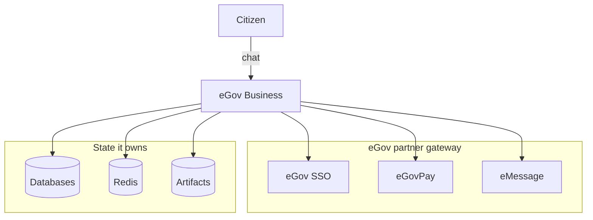

eGov Business registers a Philippine sole-proprietor business through a chat conversation.
A citizen describes the business they want to open, and an agent carries the registration
end to end: a DTI business name through BNRS, a combined LGU business permit and barangay
clearance, and BIR Forms 1901 and 1905 as filled PDFs. Each fee is paid through eGovPay
hosted checkout along the way.

The governing constraint is stated in the repository README and it shapes every design
decision below: **everything the assistant asserts comes from an authenticated eGov call or
a record the system wrote itself.** The agent is not permitted to invent a certificate
number, a fee, or a payment status.

## System context

Only three of the nine eGov partner services are wired into a runtime path today: SSO for
sign-in, eGovPay for every fee, and eMessage for SMS. Five of the rest are covered by the SDK
and have gateway URLs in `.env.example`, but no workspace reads them yet. The sixth, eGov AI,
was evaluated and deliberately not used — its assistant endpoint generates text and cannot
host a tool-calling agent loop, which is
[written up in full](/egov/integration-points#why-the-agent-does-not-run-on-egov-ai). The
complete list is in [eGov integration points](/egov/integration-points).

Every arrow above is outbound. There is one inbound path that this level of detail omits:
eGovPay posts a payment callback back into the app, which makes it the only route where an
external system initiates a state change. [Runtime topology](/architecture/containers) shows
it alongside the app's internal structure, and [payments](/egov/egovpay) explains why that
callback is verified rather than trusted.

## The three registration tracks

A registration is not one linear process. It is three independently-owned flows that the
app orchestrates, each with its own database tables, its own payment, and its own issued
document.

| Track                             | Package            | Issues                                                              | Fee                              |
| --------------------------------- | ------------------ | ------------------------------------------------------------------- | -------------------------------- |
| DTI business name                 | `@omsimos/dx/bnrs` | JSON certificate, `BNN-YYYYMMDD-XXXXXXXX`                           | PHP 530 / 1,030 / 2,030 by scope |
| LGU permit and barangay clearance | `@omsimos/dx/lgu`  | Permit `LGU-BP-YYYY-XXXXXXXX` plus clearance `LGU-BC-YYYY-XXXXXXXX` | PHP 2,500 fixed                  |
| BIR Forms 1901 and 1905           | `@omsimos/dx/bir`  | Filled PDF artifacts                                                | PHP 30 documentary stamp tax     |

The two agencies are deliberately isolated from each other. LGU cannot import, call, query,
or share persistence with BNRS. It accepts a structured certificate credential and validates
its shape, but it has no BNRS lookup and no cryptographic verification — the orchestrating
route is what fetches the authoritative certificate and hands it over. See
[agency isolation](/flows/lgu#agency-isolation) for why that boundary is drawn this way.

## Where to go next

- [Runtime topology](/architecture/containers) — what runs where, and the deployment shape.
- [Chat request lifecycle](/architecture/request-lifecycle) — the agent loop and resumable streams.
- [State and storage](/architecture/data-and-storage) — the two separate databases, Redis, and the artifact store.
- [Trust boundaries](/architecture/trust-boundaries) — where credentials live and how citizen PII is handled.
- [Registration journey](/flows/registration) — the end-to-end citizen flow across all three tracks.
- [eGov integration points](/egov/integration-points) — every partner service, wired or available.

The `egov.js` SDK that every partner call goes through is MIT-licensed and developed in the
open at [omsimos/egov.js](https://github.com/omsimos/egov.js), with its own documentation at
[egov-sdk.omsimos.com](https://egov-sdk.omsimos.com). It has a separate release cycle, so
this repository pins a version rather than tracking its main branch.
